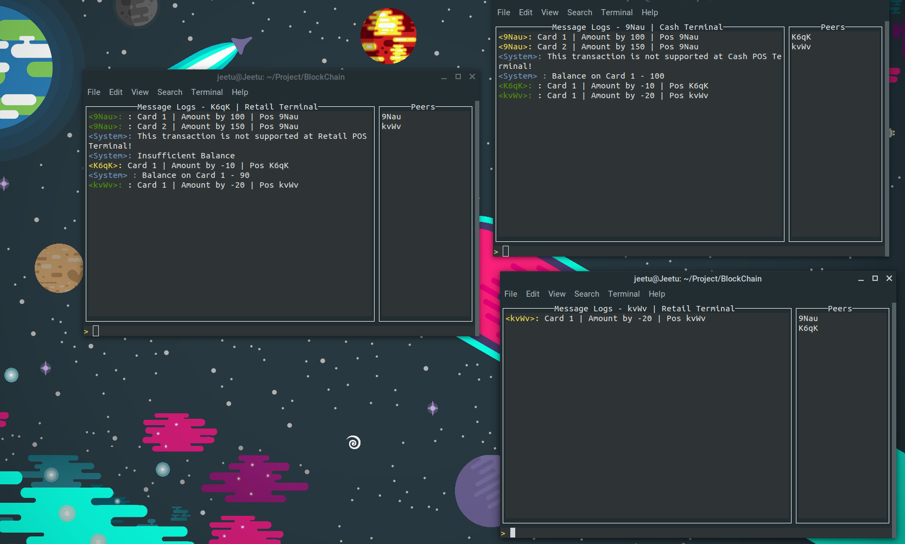

<h1> PosChain</h1> 

A blockChain to manage Point-of-Sale Transactions.

### Build Instructions

- To build program use 
	
	`go build -o posTerminal ` 
- To run the program, use 
	
	`./posTerminal -cashPos=false` to Make it Retail Terminal  
	`./posTerminal -cashPos=true` to Make it Cash Terminal  

### Input Format 

- Create New Card : Enter `<CardID>  <SPACE> 0` in the input window.
- Add Balance to New Card : Enter `<CardID>  <SPACE> <Amount> ` in the input window.
- Check Balance on a Card : Enter `/balance <SPACE> <CardID>` in the input window.
- Process Purchase with Card : Enter `<CardID> <SPACE> <Amount>` in the input window, where amount is negative. In case a user want to deduct more amount than what he has, the transaction will not be processed. And error will be diplayed.
- See BlockChain Status : Enter `/dump <file_Name>`, the current block-chain state will be dumped to a file named `<file_Name>.txt` 
- Quit the Pos : Enter `/quit` into the input window

### Assumption 

- When a instance of node is started, it will take 2 - 3 seconds to sync and process the current state of chain from its peers
- In Case of network failure, host will be restarted.

### Reference
[libp2p PubSub Example](https://github.com/libp2p/go-libp2p-examples/tree/master/pubsub)

